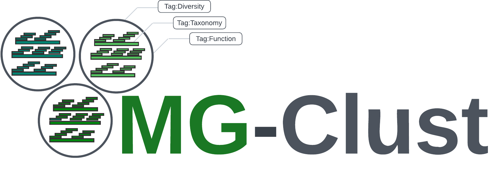

## Comprehensive characterization of functional compositional structure: Identifying and clustering ORF sequences from metagenomic data into Operational Protein Units

[](https://doi.org/10.5281/zenodo.19493771)

MG-Clust is a Nextflow pipeline for computing Operational Protein Units (OPUs) from metagenomic data. It takes paired-end reads from multiple samples, assembles them, maps the reads back onto the assembled contigs to compute per-ORF coverage, predicts ORFs, and clusters them by amino acid sequence identity. Per-ORF coverage values are then aggregated across all ORFs within each cluster to produce two per-OPU abundance tables: one based on mean sequencing depth and one based on read counts. In addition, the pipeline annotates contigs taxonomically against the GTDB database, annotates ORFs functionally against KEGG KO HMM profiles, and merges all annotation and abundance tables into a single integrated output.


---

# Repository structure

Each module is implemented across four files that together define its logic, environment, container, and Nextflow integration:

| File | Location | Purpose |
|---|---|---|
| Python script | `bin/mg-clust-module-N.py` | All processing logic; called by Nextflow |
| Conda environment | `docker/resources/requirements-module-N.yml` | Pins tool versions for the conda environment |
| Dockerfile | `docker/Dockerfile.module-N` | Builds the container image from the conda environment |
| Nextflow process | `modules/mg-clust-module-N.nf` | Wraps the Python script; declares inputs, outputs, and container |

```
MG-Clust/
├── bin/                               # Python pipeline scripts
│   ├── mg-clust-module-1.py           # De novo assembly and read mapping
│   ├── mg-clust-module-2.py           # ORF prediction and coverage estimation
│   ├── mg-clust-module-3.py           # ORF filtering, MMseqs2 DB creation, and clustering
│   ├── mg-clust-module-4.py           # Taxonomic annotation via MMseqs2 + GTDB
│   ├── mg-clust-module-5.py           # Functional annotation via pyHMMER + KO profiles
│   ├── mg-clust-module-6.py           # Build unified OPU-ORF coverage table
│   └── utils.py                       # Shared utility functions
├── docker/
│   ├── Dockerfile.module-1            # Docker image for module 1
│   ├── Dockerfile.module-2            # Docker image for module 2
│   ├── Dockerfile.module-3            # Docker image for module 3
│   ├── Dockerfile.module-4            # Docker image for module 4
│   ├── Dockerfile.module-5            # Docker image for module 5
│   ├── Dockerfile.module-6            # Docker image for module 6
│   ├── dockerbuild_commands.sh        # Build all module images
│   └── resources/                     # Conda environment YAML files
│       ├── requirements-module-1.yml
│       ├── requirements-module-2.yml
│       ├── requirements-module-3.yml
│       ├── requirements-module-4.yml
│       ├── requirements-module-5.yml
│       └── requirements-module-6.yml
├── modules/
│   ├── mg-clust-module-1.nf           # Nextflow process: MODULE1
│   ├── mg-clust-module-2.nf           # Nextflow process: MODULE2
│   ├── mg-clust-module-3.nf           # Nextflow process: MODULE3
│   ├── mg-clust-module-4.nf           # Nextflow process: MODULE4
│   ├── mg-clust-module-5.nf           # Nextflow process: MODULE5
│   └── mg-clust-module-6.nf           # Nextflow process: MODULE6
├── figures/
│   └── MG-Clust.png                   # Pipeline diagram
├── test/                              # Test data and test scripts
├── main.nf                            # Nextflow pipeline entry point
├── nextflow.config                    # Pipeline configuration and parameters
└── LICENSE
```

---

# Installation

## Requirements

- [Nextflow](https://www.nextflow.io) >= 23.x
- [Docker](https://www.docker.com)

All tool dependencies are packaged in Docker images hosted on GitHub Container Registry. No local tool installation is required beyond Nextflow and Docker.

## Docker images

Docker images are pulled automatically from GitHub Container Registry when the pipeline runs. To rebuild images locally from the repo root:

```bash
bash docker/dockerbuild_commands.sh
```

Individual images can also be built separately:

```bash
docker build --network=host -f docker/Dockerfile.module-N -t ghcr.io/epereira/mg-clust/module-N:latest .
```

> **Note:** Build commands must be run from the **repo root** because Dockerfiles reference paths under `docker/resources/` relative to the build context.

### External databases

Modules 4 and 5 require large reference databases that are **not** bundled in the Docker images. They are downloaded automatically on first use and cached at the paths below (configurable via `nextflow.config`):

| Module | Database | Default path |
|---|---|---|
| 4 | GTDB (MMseqs2 taxonomy) | `~/.mg-clust/db/gtdb/gtdb` |
| 5 | KEGG KO HMM profiles | `~/.mg-clust/db/ko/ko_profiles.hmm` |

The database directories are bind-mounted into the containers at runtime so the download is persistent across runs.

---

# How to use

## Quick start

```bash
nextflow run main.nf --input_dir data/reads --output_dir results
```

By default, Nextflow looks for paired-end reads matching `*_R{1,2}*.fastq` inside `input_dir`.

## Input

Paired-end FASTQ files placed in the directory specified by `--input_dir`. Sample names are inferred automatically from filenames using `--reads_pattern`.

```
data/reads/
    sample1_R1.fastq
    sample1_R2.fastq
    sample2_R1.fastq
    sample2_R2.fastq
```

## Parameters

All parameters can be set in `nextflow.config` or overridden on the command line with `--param value`. Run `nextflow run main.nf --help` to print the full reference:

```
MG-Clust: Operational Protein Units from metagenomic paired-end reads

Usage: nextflow run main.nf [options]

General:
  --input_dir       DIR   Input directory with paired-end FASTQ files (default: ./test/data)
  --reads_pattern   STR   Glob pattern for fromFilePairs (default: *_R{1,2}*.fastq)
  --output_dir      DIR   Output directory (default: ./test/mg-clust-output/)
  --nslots          INT   CPU threads per tool (default: 16)
  --stop_at_module  INT   Stop after module N, 1-6 (default: 6)
  --full_output     BOOL  Publish all intermediate outputs (default: true)
  --skip_tax_annot  BOOL  Skip MODULE4 taxonomic annotation (default: false)
  --skip_fun_annot  BOOL  Skip MODULE5 functional annotation (default: false)
  --maxForks        INT   Max parallel process instances (default: 3)

MODULE1 — Assembly:
  --assem_preset    STR   MEGAHIT preset (default: meta-sensitive)
  --min_contig_len  INT   Minimum contig length in bp (default: 250)
  --min_seq         INT   Minimum reads required to assemble (default: 5)

MODULE2 — ORF prediction:
  --train_file_name STR   Prodigal training file name (default: illumina_1)

MODULE3 — ORF clustering:
  --min_orf_len     INT   Minimum ORF length in aa (default: 60)
  --clust_thres     NUM   MMseqs2 identity threshold 0-1 (default: 0.7)
  --clust_cov_len   NUM   MMseqs2 coverage threshold 0-1 (default: 0.85)

MODULE4 — Taxonomic annotation (GTDB):
  --gtdb            PATH  MMseqs2 GTDB database prefix (default: ~/.mg-clust/db/gtdb/gtdb)
  --lca_mode        INT   MMseqs2 LCA mode (default: 3)
  --sensitivity     NUM   MMseqs2 sensitivity (default: 4.0)
  --tax_lineage     INT   MMseqs2 --tax-lineage flag (default: 1)

MODULE5 — Functional annotation (KO HMMs):
  --hmm_db          PATH  KO HMM profiles file (default: ~/.mg-clust/db/ko/ko_profiles.hmm)
  --evalue_thres    NUM   E-value threshold (default: 1e-3)
  --cut_ga          BOOL  Use per-profile GA cutoffs (default: false)
```

## Partial execution

The `--stop_at_module` parameter allows the pipeline to be stopped after a specific module. This is useful for inspecting intermediate results or running only part of the analysis.

```bash
# Run assembly and read mapping only (module 1)
nextflow run main.nf --stop_at_module 1

# Run through ORF prediction (modules 1–2)
nextflow run main.nf --stop_at_module 2

# Run through ORF filtering, DB creation, and clustering (modules 1–3)
nextflow run main.nf --stop_at_module 3

# Run through taxonomic annotation (modules 1–4)
nextflow run main.nf --stop_at_module 4

# Run through functional annotation (modules 1–5)
nextflow run main.nf --stop_at_module 5

# Run the full pipeline including table integration (modules 1–6, default)
nextflow run main.nf
```

The outputs of the last module to run are always published to `--output_dir`. Intermediate module outputs (from earlier modules) are only published when `--full_output true` is set:

```bash
# Run through module 2 and publish outputs from both modules 1 and 2
nextflow run main.nf --stop_at_module 2 --full_output true
```

Taxonomic and functional annotation can be skipped independently without stopping the pipeline early:

```bash
# Run full pipeline but skip taxonomic annotation
nextflow run main.nf --skip_tax_annot true

# Run full pipeline but skip functional annotation
nextflow run main.nf --skip_fun_annot true
```

---

# Module documentation

> **Note:** The sections below document the parameters and behaviour of each Python module for reference purposes. These scripts are executed automatically by the Nextflow pipeline and are not intended to be run directly by users.

---

## mg-clust-module-1.py

> Stop after this module with `--stop_at_module 1`.

De novo assembly of paired-end reads and mapping back to the assembly.

```bash
mg-clust-module-1.py \
    --reads1            <R1.fastq> \
    --reads2            <R2.fastq> \
    --sample_name       <sample> \
    --output_dir        <output_dir> \
    --nslots            4 \
    --assem_preset      meta-sensitive \
    --min_contig_length 250 \
    --min_seq           5 \
    [--markdup] \
    [--overwrite]
```

| Parameter | Default | Description |
|---|---|---|
| `--reads1` | — | R1 FASTQ file (required) |
| `--reads2` | — | R2 FASTQ file (required) |
| `--sample_name` | — | Sample name used to prefix output files (required) |
| `--output_dir` | — | Output directory (required) |
| `--assem_preset` | `meta-sensitive` | MEGAHIT preset (`meta-sensitive`, `meta-large`, etc.) |
| `--min_contig_length` | `250` | Discard contigs shorter than this (bp) |
| `--min_seq` | `5` | Minimum assembled sequences to continue |
| `--markdup` | `false` | Run Picard MarkDuplicates to remove PCR duplicates |
| `--nslots` | `4` | Threads |
| `--overwrite` | `false` | Overwrite output directory if it exists |

**Outputs:**
- `<sample_name>/assembly/<sample_name>.contigs.fa` — assembled contigs
- `<sample_name>/<sample_name>_sorted.bam` — coordinate-sorted BAM of reads mapped to contigs

---

## mg-clust-module-2.py

> Stop after this module with `--stop_at_module 2`.

ORF prediction from assembled contigs and per-ORF coverage estimation.

```bash
mg-clust-module-2.py \
    --assembly_file   <contigs.fa> \
    --bam_file        <sorted.bam> \
    --sample_name     <sample> \
    --output_dir      <output_dir> \
    --nslots          4 \
    --train_file_name illumina_1 \
    [--overwrite]
```

| Parameter | Default | Description |
|---|---|---|
| `--assembly_file` | — | FASTA file of assembled contigs (required) |
| `--bam_file` | — | Sorted BAM of reads mapped to contigs (required) |
| `--sample_name` | — | Sample name used to prefix output files (required) |
| `--output_dir` | — | Output directory (required) |
| `--train_file_name` | `illumina_1` | FragGeneScanRs training model |
| `--nslots` | `4` | Threads |
| `--overwrite` | `false` | Overwrite output directory if it exists |

**Outputs:**
- `<sample_name>/<sample_name>_orfs.faa` — predicted ORF protein sequences
- `<sample_name>/<sample_name>_orfs.bed` — ORF coordinates in BED format
- `<sample_name>/<sample_name>_orfs_meancov.tsv` — mean sequencing depth per ORF
- `<sample_name>/<sample_name>_orfs_readscov.tsv` — read count per ORF

---

## mg-clust-module-3.py

> Stop after this module with `--stop_at_module 3`.

Concatenation of per-sample ORFs, length filtering, MMseqs2 database creation, and ORF clustering. Runs once across all samples.

```bash
mg-clust-module-3.py \
    --orf_files      <sample1_orfs.faa> <sample2_orfs.faa> ... \
    --output_dir     <output_dir> \
    --nslots         4 \
    --min_orf_len    60 \
    --clust_thres    0.7 \
    --clust_cov_len  0.85 \
    [--overwrite]
```

| Parameter | Default | Description |
|---|---|---|
| `--orf_files` | — | Per-sample ORF FASTA files (required) |
| `--output_dir` | — | Output directory (required) |
| `--min_orf_len` | `60` | Minimum ORF length in amino acids; shorter ORFs are discarded |
| `--clust_thres` | `0.7` | Sequence identity threshold for MMseqs2 clustering |
| `--clust_cov_len` | `0.85` | Minimum fraction of aligned residues (`-c` in MMseqs2) |
| `--nslots` | `4` | Threads |
| `--overwrite` | `false` | Overwrite output directory if it exists |

**Outputs:**
- `orfs.faa` — concatenated ORF protein sequences (all samples)
- `orfs_filt-minlen<N>aa.faa` — length-filtered ORF protein sequences
- `orfs_filt_db-minlen<N>aa/` — MMseqs2 database of filtered ORFs
- `orfs_clust-minlen<N>aa-id<N>perc/orfs_clust-minlen<N>aa-id<N>perc.tsv` — cluster membership table (columns: `cluster_representative`, `orf_id`)

---

## mg-clust-module-4.py

> Stop after this module with `--stop_at_module 4`. Runs in parallel per sample.

Taxonomic annotation of assembled contigs against the GTDB database using MMseqs2 taxonomy. Also maps contig-level taxonomy to ORF IDs via the BED file from module 2.

If the GTDB database is absent at `--gtdb`, it is downloaded automatically via `mmseqs databases GTDB`.

```bash
mg-clust-module-4.py \
    --contigs       <contigs.fa> \
    --bed_file      <sample_orfs.bed> \
    --sample_name   <sample> \
    --output_dir    <output_dir> \
    --gtdb          ~/.mg-clust/db/gtdb/gtdb \
    --lca_mode      3 \
    --sensitivity   4.0 \
    --tax_lineage   1 \
    --nslots        4 \
    [--overwrite]
```

| Parameter | Default | Description |
|---|---|---|
| `--contigs` | — | Assembled contigs FASTA (required) |
| `--bed_file` | — | ORF BED file from module 2; used to map ORF IDs to contig taxonomy (required) |
| `--sample_name` | — | Sample name used to prefix output files (required) |
| `--output_dir` | — | Output directory (required) |
| `--gtdb` | `~/.mg-clust/db/gtdb/gtdb` | MMseqs2 GTDB taxonomy database prefix |
| `--lca_mode` | `3` | LCA mode: 1 = single-hit, 2 = LCA of best hits, 3 = top-hit with LCA fallback |
| `--sensitivity` | `4.0` | MMseqs2 search sensitivity (`-s`) |
| `--tax_lineage` | `1` | Include full taxonomic lineage (1 = yes, 0 = no) |
| `--nslots` | `4` | Threads |
| `--overwrite` | `false` | Overwrite output directory if it exists |

**Outputs (inside `<sample_name>/`):**
- `<sample_name>_contig_tax_annot.tsv` — per-contig taxonomy (columns: `contig_id`, `taxid`, `rank`, `name`, `lineage`)
- `<sample_name>_contig_tax_report.txt` — Kraken-style taxonomy report
- `<sample_name>_orf_tax_annot.tsv` — per-ORF taxonomy via left join on BED file (columns: `orf_id`, `taxid`, `rank`, `name`, `lineage`)

---

## mg-clust-module-5.py

> Stop after this module with `--stop_at_module 5`. Runs in parallel per sample.

Functional annotation of predicted ORF protein sequences against KEGG KO HMM profiles using pyHMMER. Outputs the best-scoring KO hit per ORF.

If the KO profile database is absent at `--hmm_db`, it is downloaded automatically from the KEGG FTP.

```bash
mg-clust-module-5.py \
    --orfs_faa      <sample_orfs.faa> \
    --sample_name   <sample> \
    --output_dir    <output_dir> \
    --hmm_db        ~/.mg-clust/db/ko/ko_profiles.hmm \
    --evalue_thres  1e-3 \
    [--cut_ga | --no-cut_ga] \
    --nslots        4 \
    [--overwrite]
```

| Parameter | Default | Description |
|---|---|---|
| `--orfs_faa` | — | ORF protein sequences from module 2 (required) |
| `--sample_name` | — | Sample name used to prefix output files (required) |
| `--output_dir` | — | Output directory (required) |
| `--hmm_db` | `~/.mg-clust/db/ko/ko_profiles.hmm` | Path to the KO HMM profile database |
| `--evalue_thres` | `1e-3` | E-value threshold; acts as fallback when `--cut_ga` is enabled |
| `--cut_ga` / `--no-cut_ga` | `--no-cut_ga` | Use per-model gathering thresholds |
| `--nslots` | `4` | Threads |
| `--overwrite` | `false` | Overwrite output directory if it exists |

**Outputs (inside `<sample_name>/`):**
- `orfs_ko_domtblout.txt` — raw pyHMMER domain table
- `<sample_name>_orf_fun_annot.tsv` — best-hit KO annotation per ORF (columns: `orf_id`, `ko_id`, `score`, `evalue`)

---

## mg-clust-module-6.py

> Stop after this module with `--stop_at_module 6` (default). Runs once after all samples complete.

Concatenates per-sample coverage, taxonomy, and functional annotation tables across all samples, then joins them with the cluster membership table from module 3 using DuckDB to produce per-OPU abundance tables annotated with taxonomy and function.

```bash
mg-clust-module-6.py \
    --meancov_files   <s1_orfs_meancov.tsv> <s2_...> ... \
    --readscov_files  <s1_orfs_readscov.tsv> <s2_...> ... \
    --clust_tsv       <orfs_clust-minlen60aa-id70perc.tsv> \
    [--tax_annot_files <s1_orf_tax_annot.tsv> <s2_...> ...] \
    [--fun_annot_files <s1_orf_fun_annot.tsv> <s2_...> ...] \
    --clust_thres     0.7 \
    --output_dir      <output_dir> \
    [--overwrite]
```

| Parameter | Default | Description |
|---|---|---|
| `--meancov_files` | — | Per-sample mean coverage TSV files from module 2 (required) |
| `--readscov_files` | — | Per-sample read count TSV files from module 2 (required) |
| `--clust_tsv` | — | Cluster membership TSV from module 3 (required) |
| `--tax_annot_files` | omitted | Per-sample taxonomy TSVs from module 4; omit when `--skip_tax_annot true` |
| `--fun_annot_files` | omitted | Per-sample function TSVs from module 5; omit when `--skip_fun_annot true` |
| `--clust_thres` | `0.7` | Clustering threshold used in module 3; used to name the output file |
| `--output_dir` | — | Output directory (required) |
| `--overwrite` | `false` | Overwrite output directory if it exists |

**Outputs (always produced):**
- `orfs_meancov.tsv` — concatenated mean coverage table across all samples
- `orfs_readscov.tsv` — concatenated read count table across all samples
- `orfs_clust-minlen<N>aa-id<N>perc-coverage.tsv` — per-ORF coverage joined with cluster membership
- `orfs_clust-minlen<N>aa-id<N>perc-collapsed_coverage.tsv` — coverage summed per OPU per sample (the primary abundance table)

**Outputs (conditional):**
- `contigs_tax_annot.tsv` — concatenated taxonomy annotations across all samples (only when `--skip_tax_annot` is not set)
- `orfs-minlen<N>aa-fun_annot.tsv` — concatenated functional annotations across all samples (only when `--skip_fun_annot` is not set)

---

## Output directory structure

The pipeline writes to two top-level directories inside `--output_dir`:

- **`intermediate/`** — full outputs from each module, organised by module number. Modules 1–5 are only written here when `--full_output true` is set; module 6 is always written.
- **`workables/`** — a flat directory of symlinks pointing into `intermediate/module-6/`. These are the primary result files intended for downstream analysis. Because they are relative symlinks, the entire `output_dir` can be moved or archived (e.g. with `rsync -a` or `tar`) while keeping the links intact.

Two key parameters — minimum ORF length (`--min_orf_len`) and clustering identity threshold (`--clust_thres`) — are encoded directly into the names of output files and directories (e.g. `orfs_clust-minlen60aa-id70perc/`). This design ensures that re-running the pipeline with different values of these parameters does not overwrite existing results. Combined with Nextflow's `-resume` flag, which reuses cached task outputs for any upstream steps whose inputs have not changed, this allows parameter space exploration (e.g. sweeping clustering thresholds) at minimal computational cost: only modules 3 and 6 are re-executed, while the computationally intensive assembly, ORF prediction, and annotation steps remain cached.

```
<output_dir>/
    intermediate/
        module-1/
            <sample_name>/
                assembly/<sample_name>.contigs.fa
                <sample_name>_sorted.bam
        module-2/
            <sample_name>/
                <sample_name>_orfs.faa
                <sample_name>_orfs.bed
                <sample_name>_orfs_meancov.tsv
                <sample_name>_orfs_readscov.tsv
        module-3/
            orfs.faa
            orfs_filt-minlen60aa.faa
            orfs_filt_db-minlen60aa/
            orfs_clust-minlen60aa-id70perc/
                orfs_clust-minlen60aa-id70perc.tsv
        module-4/
            <sample_name>/
                <sample_name>_contig_tax_annot.tsv
                <sample_name>_contig_tax_report.txt
                <sample_name>_orf_tax_annot.tsv
        module-5/
            <sample_name>/
                orfs_ko_domtblout.txt
                <sample_name>_orfs-minlen60aa-fun_annot.tsv
        module-6/
            orfs_meancov.tsv
            orfs_readscov.tsv
            contigs_tax_annot.tsv                              # only when skip_tax_annot=false
            orfs-minlen60aa-fun_annot.tsv                      # only when skip_fun_annot=false
            orfs_clust-minlen60aa-id70perc-coverage.tsv
            orfs_clust-minlen60aa-id70perc-collapsed_coverage.tsv
    workables/
        orfs_clust-minlen60aa-id70perc-coverage.tsv           -> ../intermediate/module-6/...
        orfs_clust-minlen60aa-id70perc-collapsed_coverage.tsv -> ../intermediate/module-6/...
        contigs_tax_annot.tsv                                  -> ../intermediate/module-6/...  # only when skip_tax_annot=false
        orfs-minlen60aa-fun_annot.tsv                          -> ../intermediate/module-6/...  # only when skip_fun_annot=false
```

---

# Dependencies

## Pipeline

| Tool | Version | Purpose |
|---|---|---|
| [Nextflow](https://www.nextflow.io) | >= 23.x | Workflow manager |
| [Docker](https://www.docker.com) | — | Container runtime |

## Module 1

| Dependency | Version | Purpose |
|---|---|---|
| Python | >= 3.8 | Script runtime |
| [MEGAHIT](https://github.com/voutcn/megahit) | 1.2.9 | De novo metagenome assembly |
| [BWA](https://github.com/lh3/bwa) | 0.7.19 | Short read mapping |
| [samtools](https://www.htslib.org) | 1.23 | SAM/BAM processing and sorting |
| [Picard](https://broadinstitute.github.io/picard) | 3.4.0 | PCR duplicate marking (optional) |

## Module 2

| Dependency | Version | Purpose |
|---|---|---|
| Python | >= 3.8 | Script runtime |
| [FragGeneScanRs](https://github.com/unipept/FragGeneScanRs) | 1.1.0 | ORF prediction |
| [bedtools](https://bedtools.readthedocs.io) | 2.31.1 | Per-ORF coverage computation |

## Module 3

| Dependency | Version | Purpose |
|---|---|---|
| Python | >= 3.8 | Script runtime |
| [BBTools](https://jgi.doe.gov/data-and-tools/software-tools/bbtools) | 37.62 | ORF length filtering (bbduk) |
| [MMseqs2](https://github.com/soedinglab/MMseqs2) | 18.8cc5c | Sequence database creation and clustering |

## Module 4

| Dependency | Version | Purpose |
|---|---|---|
| Python | >= 3.10 | Script runtime |
| [MMseqs2](https://github.com/soedinglab/MMseqs2) | >= 15 | Taxonomy search against GTDB |

## Module 5

| Dependency | Version | Purpose |
|---|---|---|
| Python | >= 3.13 | Script runtime |
| [pyHMMER](https://pyhmmer.readthedocs.io) | >= 0.10 | HMM search against KO profiles |

## Module 6

| Dependency | Version | Purpose |
|---|---|---|
| Python | >= 3.10 | Script runtime |
| [DuckDB](https://duckdb.org) | >= 1.0 | In-process SQL merge of coverage, taxonomy, and function tables |

---

# License

This project is licensed under the GNU General Public License v3.0. See the [LICENSE](LICENSE) file for the full text.

```
MG-Clust: Clustering of ORF sequences in metagenomic data
Copyright (C) 2024  epereira

This program is free software: you can redistribute it and/or modify
it under the terms of the GNU General Public License as published by
the Free Software Foundation, either version 3 of the License, or
(at your option) any later version.

This program is distributed in the hope that it will be useful,
but WITHOUT ANY WARRANTY; without even the implied warranty of
MERCHANTABILITY or FITNESS FOR A PARTICULAR PURPOSE. See the
GNU General Public License for more details.

You should have received a copy of the GNU General Public License
along with this program. If not, see <http://www.gnu.org/licenses/>.
```
