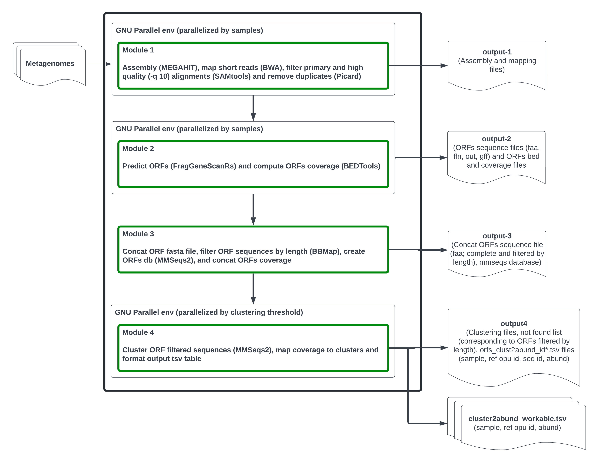

# MG-Clust
## Clustering of ORF sequences in metagenomic data
This repository contains the pipeline mg_clust. This tool is a command line application programmed in BASH and AWK, dedicated to the computation of Operational Protein Units (OPUs) in metagenomic data, based on Open Reading Frame (ORF) amino acid sequences. It takes as an input a sampling set of preprocessed (unassembled) metagenomic samples and outputs the OPUs abundance table
(see figure below).

Dependencies:  
[MEGAHIT](https://github.com/voutcn/megahit)  
[BWA](http://bio-bwa.sourceforge.net)  
[SAMTools](https://github.com/samtools/)  
[BEDTools](https://bedtools.readthedocs.io/en/latest/)  
[Picard](https://broadinstitute.github.io/picard/)  
[MMSeqs2](https://github.com/soedinglab/MMseqs2)  
[FragGeneScanRs](https://github.com/unipept/FragGeneScanRs)  
[GNU Parallel](https://www.gnu.org/software/parallel/)  

To see the help run ` ./mg-clust.bash --help`

```
Usage: ./mg-clust.bash <options>
--help                          print this help
--assem_dir CHAR                directory with previously computed assemblies (format dirname/SAMPLE_NAME/SAMPLE_NAME.contigs.fa)
--assem_preset CHAR             MEGAHIT preset to generate assembly (default meta-sensitive)
--compress t|f                  compress all output data (default f)
--clean t|f                     clean up intermediate data (default f)
--input_dir CHAR                directory of input metagenomes
--logs_file CHAR                file name to save parallel logs
--nslots NUM                    number of threads used (default 12)
--njobs NUM                     number of jobs to run in parallel (each job with nslots) (default 3)
--min_contig_length NUM         minimum length of contigs (smaller than this will be discarded; default 250) 
--min_opu_occup NUM             minimum OPU occupancy (smaller than this will be discarded; default 2)
--min_orf_length NUM            minimum length of ORFs (amino acids); ORFs shorter than this will be discarded (default 60)
--output_dir CHAR               directory to output generated data (default metaclust_output)
--overwrite t|f                 overwrite previous folder if present (default f)
--reads1_suffix CHAR            suffix of R1 reads
--reads2_suffix CHAR            suffix of R2 reads
--run_module_1 t|f              run the first processing module (assemble and map reads; this module will fail if folder output-1 exists; default t)
--run_module_2 t|f              run the second processing module (predict ORFs and compute ORFs coverage; this module will fail if folder output-2 exists; default t)
--run_module_3 t|f              run the third processing module (concatenate data and create ORFs db; this module will fail if folder output-3 exists; default t)
--run_module_4 t|f              run the fourth processing module (cluster ORFs and compute clusters abundance; folder output-4 will be kept if present; default t)
--servers CHAR,CHAR             comma separated list of servers to run metaclust
--train_file_name               train file name used to run FragGeneScan (default illumina_1)
--thres_range NUM,NUM           minimum and maximum clustering thresholds separated by comma (default 0.7,0.9)
--thres_step NUM                threshold sequence step (default 0.1)
```




